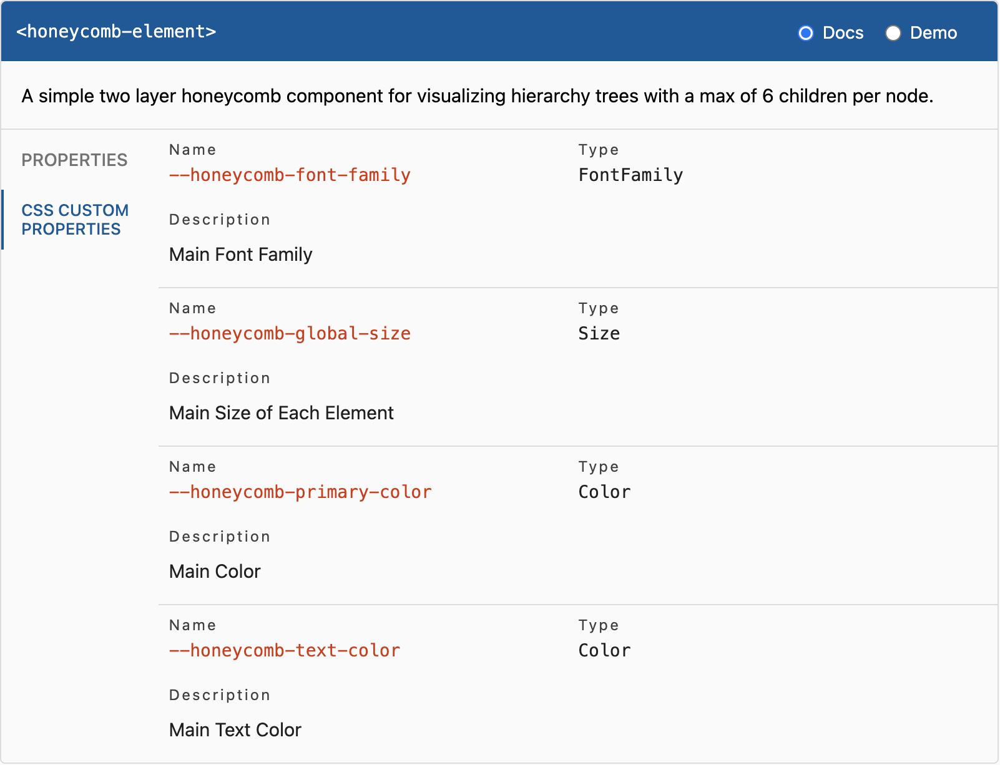

# \<honeycomb-element>

This webcomponent follows the [open-wc](https://github.com/open-wc/open-wc) recommendation.

## Installation
```bash
npm i honeycomb-element
```

## Usage
```html
<script type="module">
  import 'honeycomb-element/honeycomb-element.js';
</script>

<honeycomb-element></honeycomb-element>
```
Another way to use the component is via the [CDN UNPKG](https://unpkg.com/browse/honeycomb-element@latest/).

Import as module:
```html
<script type="module">
  import 'https://unpkg.com/honeycomb-element@latest/build/honeycomb-element.bundled.js';
</script>

<honeycomb-element></honeycomb-element>
```

Import as usual `<script>`:
```html
<head>
  <title>Honeycomb Element</title>
  <script src="https://unpkg.com/honeycomb-element@1.1.4/build/honeycomb-element.bundled.js" type="module"></script>
</head>
<body>
  <honeycomb-element></honeycomb-element>
</body>
```

Note that the keyword `@latest` always points to the latest version of the honeycomb element. If you rather want to stick to a specific version, just replace `latest`
with the according [version number](https://unpkg.com/browse/honeycomb-element@latest/) (e.g. `@1.1.4`).
## Properties
The `<honeycomb-element>` allows one property naming `items`. This way, the honeycomb is provided with content.
The `items` property is of type `array` which itself holds a maximum of 7 nested arrays. These nested arrays contain
of a maximum of 7 `objects` following the `ItemInterface`. Be aware, that the first nested array only contains one object
which represents the center element which does not expand on click.

For an example, see the [`/demo`](./demo) directory.

```js
export interface ItemInterface {
  /** Heading of hexagon */
  heading: string;
  /** Content displayed below heading. Also functions as sub heading. */
  content?: string;
  /** Image placed within the hexagon */
  image?: {
    /** URL to image */
    src: string;
    /** Title of image applied to title attribute */
    title?: string;
  };
}
```

## CSS Custom Properties


## Local Demo with `web-dev-server`
```bash
npm start
```
To run a local development server that serves the basic demo located in `demo/index.html`
